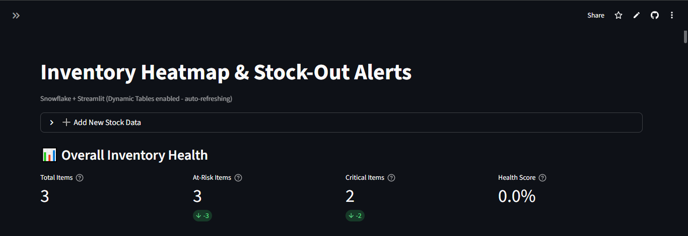
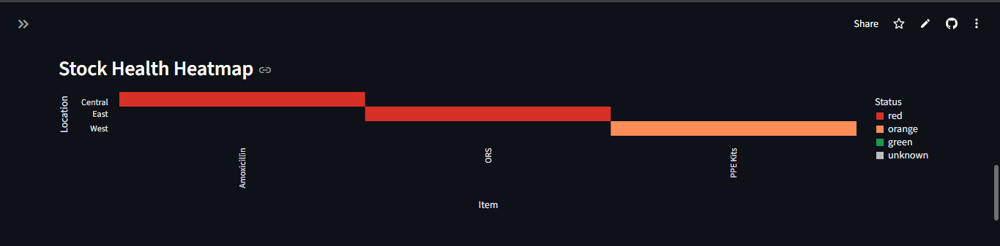
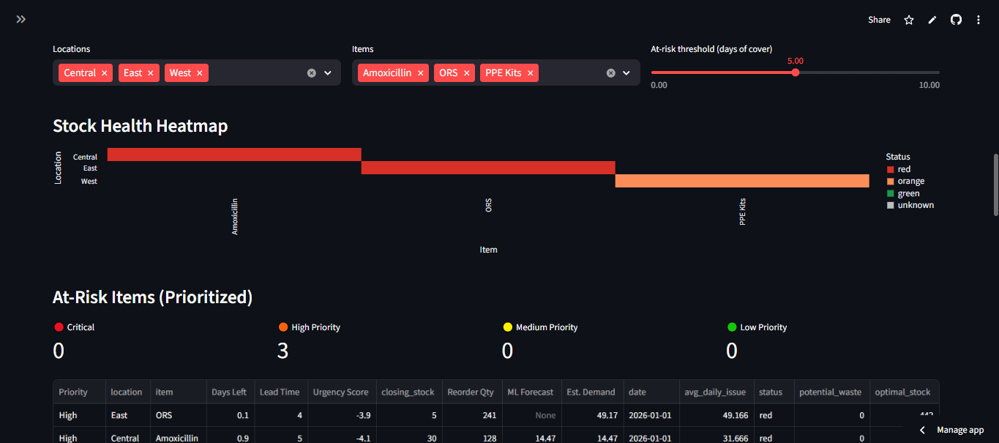
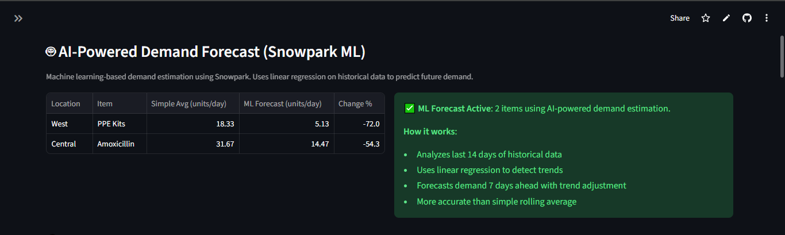
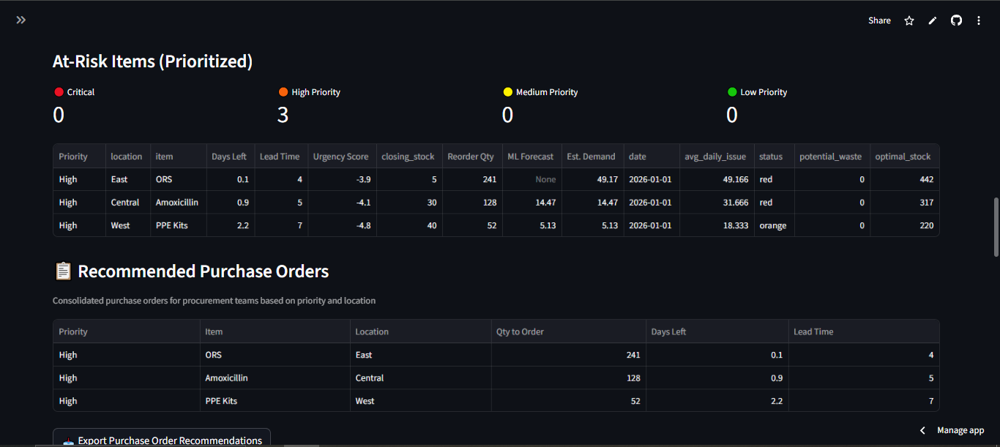
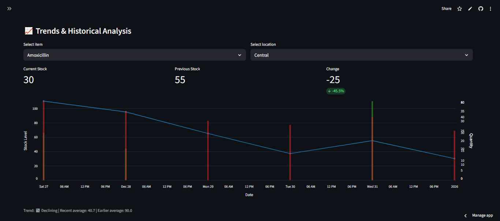
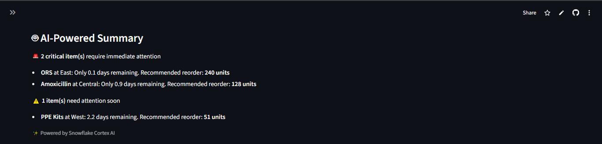
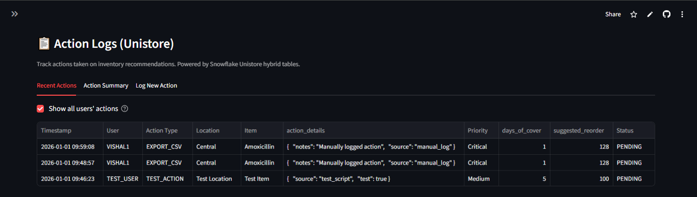
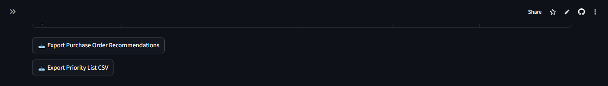
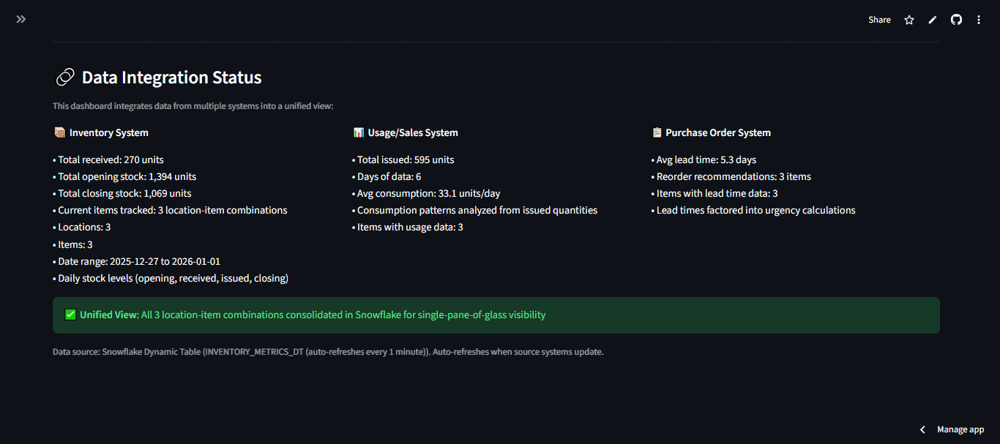

# Inventory Heatmap & Stock-Out Alerts

> **AI for Good Hackathon** - YourStory/Snowflake  
> A Snowflake-based solution for real-time inventory health monitoring and early stock-out prevention

## 🎯 Problem & Solution

**Problem:** Hospitals, public distribution systems, and NGOs struggle to keep medicines, food, and other essentials available in the right place at the right time. Data on sales/usage, inventory, and purchase orders often lives in separate systems, so teams spot stock issues only when shelves are already empty or over-full.

**Solution:** A single view of stock health that:
- ✅ Shows a **heatmap by location and item**
- ✅ **Warns early** about items likely to run out within a few days
- ✅ **Suggests sensible reorder quantities** or priority lists
- ✅ Provides **easy export** that procurement or field teams can act on

**Impact:** Helps reduce waste and avoid stock-outs of critical supplies.

## 🏗️ Architecture

### Tech Stack (Snowflake)
- **Worksheets/SQL** - Data modeling and analytics
- **Dynamic Tables** - Auto-refresh calculations
- **Streams & Tasks** - Scheduling and automation
- **Streamlit** - Interactive dashboard
- **Snowpark ML** - Machine learning-based demand forecasting (linear regression)
- **Snowflake Cortex** - AI-powered plain-language summaries
- **Unistore** - Action logs (hybrid tables for transactional and analytical workloads)

### Data Flow
```
stock_daily (table)
    ↓
Dynamic Tables (auto-refresh)
    ↓
Snowpark ML (demand forecasting) ← Optional: ML-based demand prediction
    ↓
Streamlit Dashboard
    ↓
Export & Alerts
    ↓
Unistore (action_logs) ← Hybrid table: logs user actions
```

### AI/ML Components
- **Snowpark ML**: Linear regression for demand forecasting
  - Analyzes historical consumption patterns
  - Predicts future demand with trend adjustment
  - Enhances reorder quantity calculations
- **Snowflake Cortex**: LLM-powered summaries
  - Generates plain-language insights
  - Highlights critical items and recommendations
  - Actionable guidance for procurement teams

## 📊 Features

### 0. User Authentication & Tracking
- **Snowflake Session Authentication**: Uses Snowflake's built-in authentication (no separate login UI)
- **User Display**: Shows current Snowflake username in sidebar when connected
- **Automatic User Tracking**: All data entries and actions are tracked by Snowflake username
- **Audit Trail**: Complete history of who added/modified data in action logs
- **Access Control**: Only users with valid Snowflake credentials can connect and write data
- **Local Mode**: Shows "Local (no authentication)" when running without Snowflake connection

### 1. Overall Health Dashboard
- **Real-time metrics**: Total items, at-risk count, critical items, health score
- **Health percentage**: Percentage of items with adequate stock
- **Visual indicators**: Delta metrics showing trends
- **Dynamic updates**: All metrics calculated from actual data

### 2. Location Health Summary
- **Location-wise breakdown**: At-risk and critical item counts per location
- **Interactive charts**: Bar charts showing location health
- **Comparative analysis**: Identify locations needing attention

### 3. Item Health Summary
- **Item-wise breakdown**: At-risk and critical locations per item
- **Total reorder needs**: Aggregated reorder quantities per item
- **Criticality visualization**: Charts showing item criticality across locations

### 4. Quick Actions Section
- **Top critical items**: Automatically highlights top 5 most critical items
- **Priority-based sorting**: Critical and High priority items shown first
- **Actionable alerts**: Immediate reorder recommendations with quantities

### 5. Stock Health Heatmap
- Location × Item visualization
- Color-coded status (Red/Orange/Green/Unknown)
- Interactive tooltips with key metrics
- Filters by location and item

### 6. Early Warning System
- Configurable risk threshold (days of cover)
- At-risk items table with priority rankings
- Real-time alerts for critical items
- Priority-based sorting (Critical > High > Medium > Low)

### 7. Reorder Suggestions & Priority Lists
- Calculated reorder quantities based on:
  - Average daily issue rate
  - Current closing stock
  - Target days of cover (default: 5 days)
- **Priority ranking system** (Critical/High/Medium/Low):
  - Factors in lead time for urgency
  - Urgency score = days_of_cover - lead_time_days
  - Items sorted by priority automatically

### 8. Purchase Order Recommendations
- **Consolidated POs**: Grouped by item and location
- **Priority-based**: Sorted by urgency and days of cover
- **Export ready**: CSV download for procurement teams
- **Lead time included**: All recommendations include lead time data

### 9. Waste Reduction Metrics
- Overstock detection (items with >30 days of stock)
- Optimal stock level calculations
- Potential waste identification
- Expandable view of overstocked items
- Helps reduce inventory waste

### 10. Data Export
- CSV export for at-risk items with priority rankings
- Purchase order recommendations export
- Ready for procurement teams
- Includes all key metrics and priority levels

### 11. Trend Analysis
- Closing stock trends over time
- Per item/location visualization
- Historical data insights
- Trend direction indicators (Improving/Declining)
- Historical comparison metrics

### 12. AI-Powered Demand Forecast (Snowpark ML)
- **Machine learning-based demand estimation** using Snowpark
- **Linear regression analysis** on historical data (last 14 days)
- **Trend detection**: Identifies upward/downward consumption trends
- **7-day ahead forecast**: Predicts future demand with trend adjustment
- **Comparison view**: Shows ML forecast vs simple rolling average
- **More accurate predictions**: Better than simple average for items with trends
- **Automatic activation**: Works when connected to Snowflake with sufficient data
- **Fallback support**: Uses simple average when ML forecast unavailable

### 13. AI-Powered Summary
- Plain-language insights using Snowflake Cortex
- Highlights critical and warning items
- Actionable recommendations for procurement teams
- Falls back to simple summary when Cortex unavailable

### 14. Action Logs (Unistore)
- **Hybrid table logging**: Tracks all user actions on inventory recommendations
- **Action types**: CSV exports, alert acknowledgments, PO creation, view details, dismissals
- **Three-tab interface**:
  - **Recent Actions**: View last 50 actions with full details
  - **Action Summary**: Statistics by action type with metrics
  - **Log New Action**: Manual action logging interface
- **Real-time monitoring**: View recent actions, summaries, and pending items
- **Automatic logging**: Actions logged automatically when exporting CSV files
- **Manual logging**: Interface to manually log actions for audit purposes
- **Analytical queries**: Built-in views for action summaries and trends
- **Transactional writes**: Fast inserts for real-time action tracking
- **Smart status detection**: Automatically detects if Unistore is available and shows appropriate messages

### 15. Data Integration Status
- **Dynamic data source detection**: Automatically detects Snowflake Dynamic Tables, Views, or local CSV
- **Real-time metrics**: Shows actual data from all integrated systems:
  - Inventory System: Total received, opening/closing stock, date ranges
  - Usage/Sales System: Total issued, consumption patterns, usage data
  - Purchase Order System: Lead times, reorder recommendations
- **Unified view**: Single-pane-of-glass visibility across all systems
- **All data is dynamic**: No hardcoded values, everything calculated from actual data

## 🚀 Getting Started

### Prerequisites
- **Snowflake Account**: Sign up for a free trial at [snowflake.com](https://signup.snowflake.com/) (no credit card required)
- **Python 3.8+**: For local development
- **Git**: To clone the repository

---

## 📋 Step-by-Step Setup Guide

### Option 1: Run Locally (Quick Demo)

This option uses the sample CSV data and doesn't require Snowflake connection.

#### Step 1: Clone the Repository
```bash
git clone https://github.com/vishal590/inventory-heatmap-stock.git
cd inventory-heatmap-stock
```

#### Step 2: Create Virtual Environment (Recommended)
```bash
# Windows
python -m venv .venv
.venv\Scripts\activate

# Mac/Linux
python -m venv .venv
source .venv/bin/activate
```

#### Step 3: Install Dependencies
```bash
pip install -r requirements.txt
```

#### Step 4: Run the Application
```bash
streamlit run app.py
```

The app will automatically open in your browser at `http://localhost:8501`

**Note:** Without Snowflake connection, the app uses `data/sample_stock.csv` as fallback data.

---

### Option 2: Full Setup with Snowflake

This option connects to Snowflake and uses Dynamic Tables, Streams & Tasks.

#### Step 1: Clone the Repository
```bash
git clone https://github.com/vishal590/inventory-heatmap-stock.git
cd inventory-heatmap-stock
```

#### Step 2: Set Up Snowflake

1. **Log in to Snowflake Snowsight**
   - Go to [app.snowflake.com](https://app.snowflake.com)
   - Sign in with your account

2. **Create Database and Schema**
   - Open a new SQL Worksheet in Snowsight
   - Run the following:
   ```sql
   USE ROLE ACCOUNTADMIN;
   USE WAREHOUSE COMPUTE_WH;
   CREATE DATABASE IF NOT EXISTS AI_GOOD;
   USE DATABASE AI_GOOD;
   CREATE SCHEMA IF NOT EXISTS PUBLIC;
   USE SCHEMA PUBLIC;
   ```

3. **Run Initial Setup SQL**
   - In Snowsight, open `sql/setup.sql` from the cloned repository
   - Copy the entire contents
   - Paste into Snowsight SQL Worksheet
   - Click "Run" or press Ctrl+Enter
   - This creates:
     - `stock_daily` table with sample data
     - `inventory_metrics_v` view
     - `inventory_at_risk_v` view

4. **Add Dynamic Tables (Recommended)**
   - Open `sql/dynamic_tables.sql` from the repository
   - Copy and run in Snowsight
   - This creates auto-refreshing Dynamic Tables:
     - `inventory_metrics_dt`
     - `inventory_at_risk_dt`

5. **Add Streams & Tasks (Optional)**
   - Open `sql/streams_tasks.sql` from the repository
   - Copy and run in Snowsight
   - This sets up:
     - Stream for change detection
     - Tasks for automation

6. **Add Unistore Action Logs (Optional but Recommended)**
   - Open `sql/unistore_action_logs.sql` from the repository
   - Copy and run in Snowsight
   - This creates:
     - `action_logs` hybrid table for action tracking
     - Views for recent actions (`recent_actions_v`), summaries (`action_summary_v`), and pending actions (`pending_actions_v`)
     - Indexes for fast queries on timestamp, action type, and location/item
   - **Note**: After running the SQL, refresh your Streamlit app to see the Action Logs interface
   - The app will automatically detect when Unistore is available and show the full interface

7. **Add Cortex AI SQL Functions (Optional)**
   - Open `sql/cortex_ai_functions.sql` from the repository
   - Copy and run in Snowsight
   - This creates:
     - `generate_inventory_summary()` - SQL function that uses Cortex to generate AI summaries
     - `explain_reorder_recommendation()` - SQL function that explains reorder recommendations using AI
     - `daily_ai_summaries` table - For storing daily AI-generated summaries (optional)
   - **Note**: Requires Cortex enabled in your Snowflake account
   - These functions can be called from SQL queries or integrated into the Streamlit app

#### Step 3: Set Up Local Environment

1. **Create Virtual Environment**
   ```bash
   # Windows
   python -m venv .venv
   .venv\Scripts\activate

   # Mac/Linux
   python -m venv .venv
   source .venv/bin/activate
   ```

2. **Install Dependencies**
   ```bash
   pip install -r requirements.txt
   ```

#### Step 4: Run the Application Locally

```bash
streamlit run app.py
```

The app will:
- Try to connect to Snowflake if running in Snowflake Streamlit
- Try to connect using Streamlit secrets (for Streamlit Cloud)
- Try to connect using environment variables (for local development)
- Fall back to CSV data if no connection available
- Display the dashboard at `http://localhost:8501`

---

### Option 3: Deploy to Streamlit Cloud

Deploy your app to Streamlit Cloud (streamlit.app) with Snowflake connection.

#### Step 1: Complete Snowflake Setup
Follow **Step 2** from Option 2 above to set up tables, views, and Dynamic Tables in Snowflake.

#### Step 2: Push Code to GitHub

1. Make sure your code is pushed to a GitHub repository
2. Repository should be public (or you need Streamlit Cloud Pro for private repos)

#### Step 3: Deploy on Streamlit Cloud

1. Go to [share.streamlit.io](https://share.streamlit.io)
2. Sign in with GitHub
3. Click **"New app"**
4. Select your repository and branch
5. Set main file: `app.py`
6. Click **"Deploy"**

#### Step 4: Configure Snowflake Connection (Secrets)

1. In Streamlit Cloud, go to your app settings
2. Click **"Secrets"** or **"⚙️ Settings"** → **"Secrets"**
3. Add your Snowflake credentials in this format:

```toml
[snowflake]
account = "your-account-identifier"
user = "your-username"
password = "your-password"
warehouse = "COMPUTE_WH"
database = "AI_GOOD"
schema = "PUBLIC"
role = "ACCOUNTADMIN"
```

**Important Security Notes:**
- Never commit secrets to GitHub
- Use Streamlit Cloud's secrets management
- For production, consider using key rotation

#### Step 5: Verify Connection

1. After deploying, check the app at `https://your-app-name.streamlit.app`
2. Look for connection status indicators:
   - Top caption should show "Snowflake + Streamlit (connected...)"
   - Sidebar should show "👤 Logged in as: YOUR_USERNAME"
   - Bottom section should show "Data source: Snowflake Dynamic Table" or "Snowflake View"

**Alternative: Environment Variables (for local testing)**

If you want to test locally with Snowflake connection, create a `.streamlit/secrets.toml` file (don't commit this):

```toml
[snowflake]
account = "your-account-identifier"
user = "your-username"
password = "your-password"
warehouse = "COMPUTE_WH"
database = "AI_GOOD"
schema = "PUBLIC"
role = "ACCOUNTADMIN"
```

Or set environment variables:
```bash
export SNOWFLAKE_ACCOUNT="your-account-identifier"
export SNOWFLAKE_USER="your-username"
export SNOWFLAKE_PASSWORD="your-password"
export SNOWFLAKE_WAREHOUSE="COMPUTE_WH"
export SNOWFLAKE_DATABASE="AI_GOOD"
export SNOWFLAKE_SCHEMA="PUBLIC"
export SNOWFLAKE_ROLE="ACCOUNTADMIN"
```

---

### Option 4: Deploy in Snowflake Streamlit

Run the app directly in Snowflake (no local setup needed).

#### Step 1: Complete Snowflake Setup
Follow **Step 2** from Option 2 above to set up tables, views, and Dynamic Tables.

#### Step 2: Create Streamlit App in Snowsight

1. In Snowsight, click **"Streamlit"** in the left sidebar
2. Click **"Create"** or **"+ Add new"** → **"Streamlit App"**
3. Name it: `Inventory Heatmap Dashboard`
4. Set context:
   - Database: `AI_GOOD`
   - Schema: `PUBLIC`
   - Warehouse: `COMPUTE_WH`

#### Step 3: Add Code

1. Open `app.py` from the cloned repository
2. Copy the entire contents
3. Paste into the Streamlit editor in Snowsight
4. Click **"Save"** and **"Run"**

The app will run directly in Snowflake and use your Snowflake data.

---

## 🔍 Verifying the Setup

### Check Snowflake Setup

Run these queries in Snowsight to verify:

```sql
-- Check if table exists and has data
SELECT COUNT(*) FROM stock_daily;
-- Should return: 18 (sample rows)

-- Check metrics view
SELECT * FROM inventory_metrics_v;
-- Should show 3 rows (one per location-item combination)

-- Check Dynamic Tables (if created)
SELECT * FROM inventory_metrics_dt;

-- Check Unistore action logs (if created)
SELECT COUNT(*) FROM action_logs;
-- Should return: 0 (no actions logged yet)

-- View recent actions (if Unistore is set up)
SELECT * FROM recent_actions_v ORDER BY action_timestamp DESC LIMIT 10;

-- View action summary (if Unistore is set up)
SELECT * FROM action_summary_v;
```

### Check Local Setup

1. Run the app: `streamlit run app.py`
2. You should see:
   - Dashboard title: "Inventory Heatmap & Stock-Out Alerts"
   - **Sidebar**: User status (shows "Local (no authentication)" when not connected to Snowflake)
   - Overall Health Dashboard with metrics
   - AI-Powered Demand Forecast section (shows info about Snowpark requirement)
   - Location and Item Health Summaries
   - Quick Actions section for critical items
   - Filters for locations and items
   - Heatmap visualization
   - At-risk items table with priority rankings
   - Purchase Order Recommendations
   - Waste Reduction Insights
   - Trend charts with historical comparison
   - AI-Powered Summary (Cortex)
   - Action Logs (Unistore) - shows info if not connected
   - Data Integration Status (showing "Local CSV" as source)

---

## 📝 Usage Instructions

### Using the Dashboard

1. **Check Your Login Status** (Sidebar)
   - When connected to Snowflake: Shows "👤 Logged in as: YOUR_USERNAME"
   - Uses Snowflake session authentication (no separate login needed)
   - When running locally: Shows "👤 Mode: Local (no authentication)"
   - Your username is automatically tracked for all data entries and actions

2. **Add New Stock Data** (if connected to Snowflake)
   - Click "➕ Add New Stock Data" expander
   - Use "Manual Entry" tab to enter single daily stock entry
   - Use "Upload CSV" tab to bulk upload multiple entries
   - Data is saved directly to Snowflake and will appear in dashboard after refresh
   - Your Snowflake username is automatically captured and logged

2. **View Overall Health**
   - Check the top metrics: Total Items, At-Risk Items, Critical Items, Health Score
   - Monitor location and item health summaries
   - Use Quick Actions section for immediate critical items

3. **Filter Data**
   - Use the location and item filters to focus on specific areas
   - Adjust the "At-risk threshold" slider to change sensitivity

4. **View Heatmap**
   - Color-coded status:
     - 🔴 Red: < 2 days of cover
     - 🟠 Orange: 2-5 days of cover
     - 🟢 Green: > 5 days of cover
     - ⚪ Unknown: No usage data available
   - Hover over cells for detailed metrics

5. **Check At-Risk Items**
   - Table shows items with low stock, sorted by priority
   - Priority levels: Critical > High > Medium > Low
   - Includes suggested reorder quantities, urgency scores, and lead times
   - Priority summary metrics at the top

6. **Review Purchase Order Recommendations**
   - View consolidated purchase orders grouped by item and location
   - Sorted by priority and urgency
   - Export as CSV for procurement teams

7. **Monitor Waste Reduction**
   - Check potential waste metrics
   - View overstocked items in expandable section
   - Identify items exceeding optimal stock levels

8. **Export Data**
   - Click "Export Priority List CSV" for at-risk items
   - Click "Export Purchase Order Recommendations" for PO data
   - Download CSV files ready for procurement teams

9. **View ML Demand Forecasts**
   - Check "AI-Powered Demand Forecast (Snowpark ML)" section
   - Compare ML forecast vs simple average
   - See forecast change percentage
   - Understand how ML improves demand prediction
   - Note: Requires Snowflake connection

10. **View Trends**
   - Select item and location from dropdowns
   - See closing stock trends over time
   - Compare current vs previous stock levels
   - View trend direction (Improving/Declining)

11. **View Action Logs**
   - Check "Action Logs (Unistore)" section
   - **Recent Actions tab**: View last 50 actions with timestamps and details
   - **Action Summary tab**: See statistics by action type (counts, first/last action times)
   - **Log New Action tab**: Manually log actions with form interface
   - Actions are automatically logged when you export CSV files
   - **Status indicators**:
     - ✅ Green: Unistore available and working
     - ⚠️ Yellow: Connected to Snowflake but table not found (run setup SQL)
     - ℹ️ Blue: Not connected to Snowflake
   - Note: Requires Snowflake connection and Unistore table setup (run `sql/unistore_action_logs.sql`)

12. **Check Data Integration Status**
   - View which data source is being used (Dynamic Tables, Views, or Local CSV)
   - See real-time metrics from all integrated systems
   - Monitor unified view status

### Adding New Data

**Option 1: Use the Streamlit App Input Form (Recommended)**
1. Click on "➕ Add New Stock Data" expander at the top of the dashboard
2. **Manual Entry tab**: Fill in the form with:
   - Date, Location, Item
   - Opening Stock, Received, Issued, Closing Stock
   - Lead Time (days)
3. Click "💾 Save Stock Data" to insert into Snowflake
   - Your Snowflake username is automatically tracked
   - Action is logged in Unistore action_logs table
4. **Upload CSV tab**: Upload a CSV file with stock data
   - CSV should have columns: date, location, item, opening_stock, received, issued, closing_stock, lead_time_days
   - Preview and upload multiple rows at once
   - Your Snowflake username is tracked for audit purposes

**Security Note**: The app uses Snowflake session authentication. Only users with valid Snowflake credentials can connect and add data. Your Snowflake username is automatically tracked for all data entries.

**Option 2: Direct SQL Insert (Alternative)**
To add new stock data directly in Snowflake:

```sql
INSERT INTO stock_daily (date, location, item, opening_stock, received, issued, closing_stock, lead_time_days)
VALUES 
  ('2026-01-02', 'Central', 'Amoxicillin', 30, 0, 25, 5, 5);
```

**Note**: 
- Input form requires Snowflake connection
- If using Dynamic Tables, they will auto-refresh within 1 minute after data is added
- For local CSV fallback, update `data/sample_stock.csv` manually

---

## 🐛 Troubleshooting

### Local App Not Starting
- **Error**: `streamlit: command not found`
  - **Solution**: Use `python -m streamlit run app.py` instead

### Snowflake Connection Issues
- **Error**: "No data found"
  - **Solution**: Verify tables exist and have data in Snowflake
  - Check database/schema context is correct

### Dynamic Tables Not Refreshing
- **Solution**: 
  - Check warehouse is running: `ALTER WAREHOUSE COMPUTE_WH RESUME;`
  - Verify TARGET_LAG is set correctly
  - Check for errors: `SELECT * FROM TABLE(INFORMATION_SCHEMA.DYNAMIC_TABLE_REFRESH_HISTORY())`

### Tasks Not Running
- **Solution**: 
  - Tasks are created in SUSPENDED state
  - Resume them: `ALTER TASK <task_name> RESUME;`
  - Check task status: `SHOW TASKS;`

### Unistore Action Logs Not Working
- **Error**: "Snowflake connection detected, but Unistore table not found"
  - **Solution**: Run `sql/unistore_action_logs.sql` in Snowsight to create the hybrid table
  - Verify table exists: `SELECT COUNT(*) FROM action_logs;`
  - Refresh the Streamlit app after creating the table
- **Error**: "Failed to log action"
  - **Solution**: 
    - Ensure `action_logs` table exists in the correct database/schema
    - Check you have INSERT permissions on the table
    - Verify the table structure matches the SQL script
- **No actions showing**: 
  - Actions are logged automatically when exporting CSV files
  - Use "Log New Action" tab to manually log actions
  - Check that you're connected to Snowflake (not using local CSV fallback)

## 📁 Project Structure

```
ai_good/
├── app.py                 # Streamlit dashboard application
├── requirements.txt       # Python dependencies
├── data/
│   └── sample_stock.csv  # Sample dataset
├── sql/
│   ├── setup.sql         # Initial setup (tables, views, data)
│   ├── dynamic_tables.sql  # Dynamic Tables for auto-refresh
│   ├── streams_tasks.sql    # Streams & Tasks for automation
│   ├── unistore_action_logs.sql  # Unistore hybrid table for action logs
│   ├── cortex_ai_functions.sql   # Cortex AI SQL functions (optional)
│   └── README.md         # SQL setup documentation
└── docs/
    └── README.md         # Detailed documentation
```

## 📈 Key Metrics Calculated

- **avg_daily_issue**: 7-day rolling average of items issued (simple method)
- **ml_forecasted_demand**: AI-powered demand forecast using Snowpark ML (linear regression on last 14 days)
- **estimated_daily_demand**: Used demand value (ML forecast if available, else simple average)
- **days_of_cover**: `closing_stock / estimated_daily_demand`
- **status**: 
  - 🔴 Red: < 2 days
  - 🟠 Orange: 2-5 days
  - 🟢 Green: > 5 days
  - ⚪ Unknown: No usage data available
- **suggested_reorder**: `MAX(0, (5 * estimated_daily_demand) - closing_stock)`
- **urgency_score**: `days_of_cover - lead_time_days` (negative = critical)
- **priority**: Critical/High/Medium/Low based on urgency and lead time
- **potential_waste**: Overstock detection (stock > 30 days)
- **optimal_stock**: `(5 + lead_time_days) * estimated_daily_demand`

## 🔧 Configuration

### User Authentication & Tracking
- **Method**: Snowflake session authentication (uses `CURRENT_USER()` SQL function)
- **Function**: `get_snowflake_user(session)` - Automatically retrieves current Snowflake username
- **Display**: Shown in sidebar when connected to Snowflake
- **Tracking**: All data entries and actions automatically include username
- **Fallback**: Shows "local_user" or "unknown_user" when not available
- **Benefits**:
  - No separate login UI needed
  - Uses Snowflake's built-in security
  - Complete audit trail of user actions
  - Access control through Snowflake credentials

### Dynamic Data Source Detection
- **Automatic detection**: App automatically detects available data sources:
  - Snowflake Dynamic Tables (INVENTORY_METRICS_DT) - preferred for auto-refresh
  - Snowflake Views (INVENTORY_METRICS_V) - fallback option
  - Local CSV (sample_stock.csv) - when Snowflake not connected
- **All metrics are dynamic**: No hardcoded values, everything calculated from actual data
- **Real-time updates**: Data Integration Status section shows actual metrics from all systems

### Dynamic Tables
- Refresh interval: 1 minute (configurable)
- Auto-updates when source data changes
- Preferred data source when available

### Streams & Tasks
- **Stream**: Detects changes in `stock_daily` table
- **Task 1**: Logs changes every minute
- **Task 2**: Checks for critical items every 5 minutes

### Snowpark ML Demand Forecasting
- **Method**: Linear regression on historical issued quantities
- **Data requirement**: At least 14 days of historical data per item/location
- **Analysis window**: Last 14 days of consumption data
- **Forecast horizon**: 7 days ahead with trend adjustment
- **Algorithm**: 
  - Calculates average issued quantity
  - Detects trend slope using linear regression
  - Applies trend to forecast: `avg_issued + (trend_slope * 7)`
- **Benefits**: 
  - More accurate than simple rolling average
  - Captures upward/downward consumption trends
  - Better reorder quantity predictions
- **Availability**: Requires Snowflake connection (Snowpark)
- **Fallback**: Uses simple 7-day rolling average when ML unavailable

### Snowflake Cortex AI Functions (SQL)
- **Status**: ✅ Available (optional SQL functions)
- **Functions Created**:
  - `generate_inventory_summary()` - Generates AI-powered summary of at-risk items using Cortex
  - `explain_reorder_recommendation(location, item)` - Explains reorder recommendations using AI
- **Usage**: Can be called from SQL queries or integrated into applications
- **Example Queries**:
  ```sql
  -- Get AI summary
  SELECT generate_inventory_summary() AS ai_summary;
  
  -- Get AI explanation for specific item
  SELECT explain_reorder_recommendation('Central', 'Amoxicillin') AS explanation;
  ```
- **Integration**: The Streamlit app uses Cortex via Python/Snowpark, but these SQL functions provide alternative access
- **Requirements**: Cortex must be enabled in your Snowflake account
- **Models**: Uses 'llama2-70b-chat' by default (can be adjusted)
- **File**: `sql/cortex_ai_functions.sql`

### Unistore (Action Logs)
- **Status**: ✅ Implemented
- **Purpose**: Tracks actions taken on inventory alerts and recommendations
- **Features**:
  - Logs CSV exports (priority lists and purchase orders) automatically
  - Tracks when users view item details
  - Records alert acknowledgments
  - Logs purchase order creation
  - Manual action logging interface with form
- **Hybrid Table**: `action_logs` - combines transactional writes and analytical queries
- **Views Available**:
  - `recent_actions_v`: Last 24 hours of actions
  - `action_summary_v`: Summary by action type with counts and timestamps
  - `pending_actions_v`: Actions requiring follow-up, sorted by priority
- **UI Integration**: 
  - Action logs section in dashboard with 3 tabs
  - Smart status detection: Shows different messages based on connection status
  - **Three states handled**:
    - ✅ Connected + Table exists: Full interface with all features
    - ⚠️ Connected + Table missing: Warning with setup instructions
    - ℹ️ Not connected: Info message about connecting to Snowflake
- **Error Handling**: Graceful fallback if table doesn't exist, with clear instructions
- **Benefits**:
  - Audit trail for inventory management decisions
  - Historical analysis of action effectiveness
  - Track procurement team responses to alerts
  - Real-time action monitoring
  - Complete action history for compliance

## 📸 Screenshots

### Main Dashboard with Heatmap

*Full dashboard view showing filters, heatmap, and at-risk items table*


*Detailed view of the Stock Health Heatmap visualization*

### Overall Health Dashboard

*Key performance indicators: Total Items, At-Risk Items, Critical Items, and Health Score*

### AI-Powered Demand Forecast (Snowpark ML)

*Machine learning-based demand estimation comparing Simple Average vs ML Forecast with trend analysis*

### At-Risk Items Table with Priority Rankings & Purchase Order Recommendations

*Prioritized at-risk items table with priority summary cards (Critical/High/Medium/Low) and recommended purchase orders for procurement teams*

### Trend Charts

*Historical stock trends showing closing stock levels over time, with received (green) and issued (red) quantities, plus trend direction indicators*

### AI-Powered Summary (Cortex)

*AI-generated plain-language insights highlighting critical items and warning items with actionable recommendations, powered by Snowflake Cortex AI*

### Action Logs (Unistore) Interface

*Action tracking interface with three tabs (Recent Actions, Action Summary, Log New Action) showing user actions on inventory recommendations, powered by Snowflake Unistore hybrid tables*

### Export Functionality

*CSV export buttons for downloading priority lists and purchase order recommendations for procurement teams*

### Data Integration Status

*Unified view showing data integration from three systems (Inventory, Usage/Sales, Purchase Order) with real-time metrics and consolidated visibility*

## 🎥 Demo Video

*Link to demo video showing:*
- App features in action
- Problem statement alignment
- Impact demonstration

**Note:** Demo video link to be added.

## 🔗 Live Application

**Working Prototype:** [https://inventory-heatmap-stock.streamlit.app/](https://inventory-heatmap-stock.streamlit.app/)

**GitHub Repository:** [https://github.com/vishal590/inventory-heatmap-stock](https://github.com/vishal590/inventory-heatmap-stock)

## 🤝 Contributing

This is a hackathon submission. For questions or feedback, please open an issue.

## 📝 License

This project is part of the AI for Good Hackathon submission.

## 🙏 Acknowledgments

- YourStory & Snowflake for organizing the hackathon
- Snowflake for providing free trial access
- Streamlit for the dashboard framework

## 📧 Contact

For questions about this project, please reach out via GitHub issues.

---

**Built for AI for Good Hackathon 2025** | **Track: Inventory Heatmap & Stock-Out Alerts**

